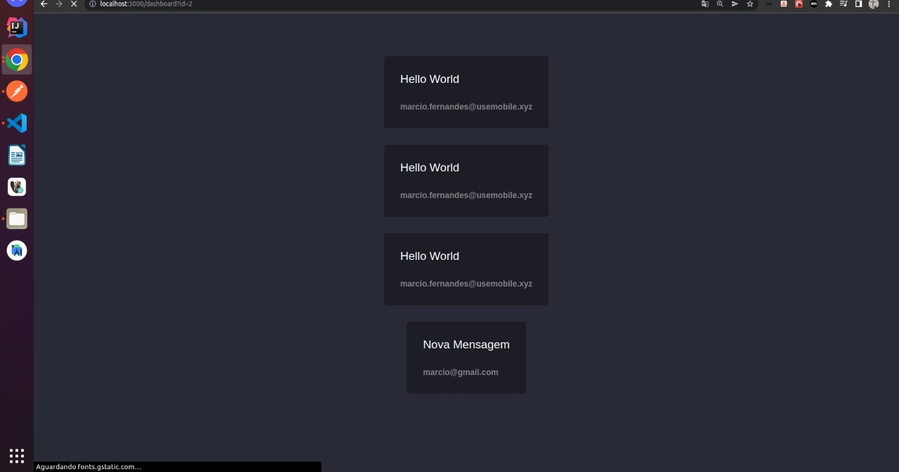

## Messaging Dashboard

This is a simple project that have login and create user and show messages registred.
Your objective is study backend.

## Technologies Used

- [x] NestJS
- [x] Typescript
- [x] GraphQL
- [x] Apollo
- [x] Typeorm
- [x] Sqlite
- [x] Decorators

Made with 🖤 by [farciomernandes](https://github.com/farciomernandes) :wave: